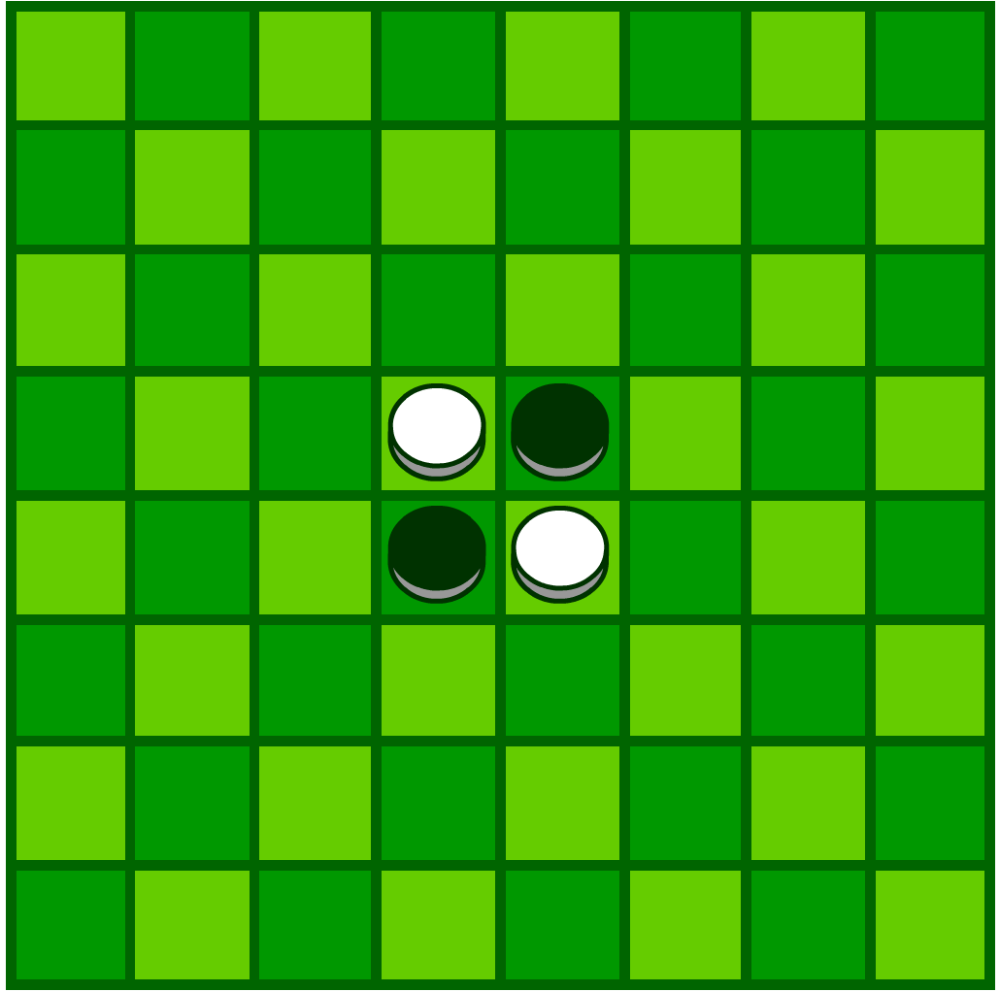

## 黑白棋

黑白棋，又叫翻转棋（Reversi）、奥赛罗棋（Othello）、苹果棋或正反棋（Anti reversi）。黑白棋在西方和日本很流行。游戏通过相互翻转对方的棋子，最后以棋盘上谁的棋子多来判断胜负。它的游戏规则简单，因此上手很容易，但是它的变化又非常复杂。有一种说法是：只需要几分钟学会它，却需要一生的时间去精通它。

黑白棋是19世纪末英国人发明的。直到上个世纪70年代日本人长谷川五郎将其进行发展和推广，借用[莎士比亚](https://baike.baidu.com/item/莎士比亚/121079)名剧奥赛罗（othello)为这个游戏重新命名（日语“オセロ”），也就是大家玩的黑白棋。为何借用莎士比亚名剧呢？是因为奥赛罗是莎士比亚一个名剧的男主角。他是一个黑人，妻子是白人，因受小人挑拨，怀疑妻子不忠一直情海翻波，最终亲手把妻子杀死。后来真相大白，奥赛罗懊悔不已，自杀而死。黑白棋就是借用这个黑人白人斗争的故事而命名。


## 规则

1、棋局开始时，黑白棋位置如图所示：



2、白方先行，双方交替下棋。

3、一步合法的棋子包括：在一个空格新落下一个棋子，并且成功翻转对方一个或者多个棋子。

4、新落下的棋子与棋盘上已有的同色棋子间，对方被夹住的所有棋子都要翻转过来。可以是横着夹，竖着夹，或是斜着夹。夹住的位置上必须全部是对手的棋子，不能有空格。

5、一步棋可以在数个方向上翻棋，任何被夹住的棋子都必须被翻转过来，棋手无权选择不去翻某个棋子。

6、除非至少翻转了对手的一个棋子，否则就不能落子。如果一方没有合法棋步，也就是说不管他下到哪里，都不能至少翻转对手的一个棋子，那他这一轮只能弃权，而由他的对手继续落子直到他有合法棋步可下。

7、如果一方至少有一步合法棋步可下，他就必须落子，不得弃权。

8、棋局持续下去，直到棋盘填满或者双方都无合法棋步可下。


## 胜负规则

如果玩家在棋盘上没有地方可以下子，则该玩家对手可以连下。双方都没有棋子可以下时棋局结束，以棋子数目来计算胜负，棋子多的一方获胜。

在棋盘还没有下满时，如果一方的棋子已经被对方吃光，则棋局也结束。将对手棋子吃光的一方获胜。


## 比赛说明

我们通过连接socket进行比赛，每当选手需要落子的时候，服务端会发送一条消息到选手，消息格式为：

```json
{
    "type": "ACTION", // 不是ACTION的不需要关心
    "name": "pdf", // 当前选手的名字
    "key": "随机的字符串", // 需要回复的时候带上这个key
    "board": [[]], // 一个8*8的二维数组
    "color": -1, // 代表当前选手的颜色,
    "point": { "x": 0, "y": 0 }, // 接收消息不需要关心
}
```

二维数组说明:

- 长度是 8*8
- 白棋代表-1，黑棋代表1，0是没有落子的点
- 接收到的总是最新的情况

返回消息说明：

- 接收到的消息中的key必须要返回，如果没有返回，则算响应超时
- 落子点必须正确，否则判输
- 超时3s没有接收到响应直接判输

一个有效的响应实例：

```json
{
    "key": "服务端传过来的",
    "point": { "x": 0, "y": 0 }
}
```

**请注意！！** <font color="red">落子一定要返回正确，否则判输，注意，落子一定是数字类型，否则直接断开连接</font>


其他说明：

- 如果你能接收到消息，说明你一定可以落子
- 你有可能长时间接收不到消息，因为你不能落子，此时对手会一直接收消息


## 获胜条件

- 双方各先手一次，赢一次得1分，分数高者获胜
- 分数相同者，以赢子为胜，比如游戏结束时，黑子40个，白子20个，则黑子胜20个子
- 胜子相同时，提交代码前者胜

**注意，选手可以提交代码多次，提交时间以最后提交为准**


## 如何连接服务端

连接的时候，需要指定选手的姓名，提供两种语言的连接方式，选手可以自行选择

### Nodejs

nodejs 可以使用 `websocket` 客户端，注意需要在连接url中增加 `name` 参数，否则服务器会拒绝连接

```javascript
var WebSocketClient = require('websocket').client;

var client = new WebSocketClient();
 
client.on('connectFailed', function(error) {
    console.log('Connect Error: ' + error.toString());
});
 
client.on('connect', function(connection) {
    console.log('WebSocket Client Connected');
    connection.on('error', function(error) {
        console.log("Connection Error: " + error.toString());
    });
    connection.on('close', function() {
        console.log('echo-protocol Connection Closed');
    });
    connection.on('message', function(message) {
      const msg = JSON.parse(message.utf8Data);
      if (msg.type == 'ACTION') {
        connection.send(Buffer.from(JSON.stringify(msg)), (e) => {
          console.log("error", e)
        })
      }
     
    });
});

client.connect('ws://192.168.10.186:8081/ws?name=pdf1');
```


### Golang

```go
package main

import (
  "flag"
  "github.com/gorilla/websocket"
  "log"
  "net/url"
)

var user string

func init() {
  flag.StringVar(&user, "user", "pdf", "指定连接人")
}

func main() {
  flag.Parse()
	u := url.URL{Scheme: "ws", Host: "localhost:8081", Path: "/ws", RawQuery: "name=" + user}
	log.Printf("connecting to %s", u.String())
	c, _, err := websocket.DefaultDialer.Dial(u.String(), nil)
	if err != nil {
		log.Fatal("dial:", err)
	}
	defer c.Close()
	errs := make(chan error)

	go func() {
		for {
			msg := &ws.Message{}
			err := c.ReadJSON(msg)
			if err != nil {
				errs <- err
				log.Println("read:", err)
				return
			}
			if msg.Type != ACTION {
				continue
			}
            c.WriteJSON(msg)
		}
	}()

	log.Fatal("Exited: ", <-errs)
}
```


测试地址为：`localhost:8080`

## 测试辅助

使用post请求:

`localhost:8080/play/:first/:back`

可以让first和back两个用户进行对战，

使用get请求:

`localhost:8080/play/:first/:back`

可以查看对战结果，当对战有结果的时候，访问:

`localhost:8080/page/show?first=xxx&back=xxx`

可以查看对战演示动画。

祝大家比赛顺利~~


